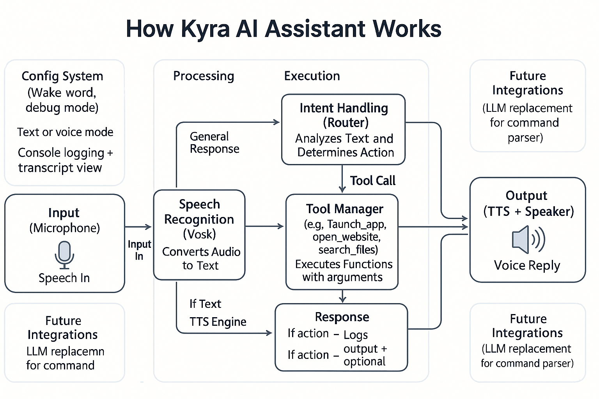

# Kyra Assistant

This project provides an offline voice assistant powered by local models.

## Setup

1. **Download a GGUF model** (e.g. `mistral-7b-instruct-v0.2.Q4_K_M.gguf`)
   ```bash
   wget https://.../mistral.gguf -O models/mistral.gguf
   ```
2. **Install dependencies**
   ```bash
   pip install -r requirements.txt
   ```
   Kyra uses **Microsoft Edge-TTS neural voices** for speech output.
3. **Download the Vosk model**
   ```bash
   wget https://alphacephei.com/vosk/models/vosk-model-small-en-us-0.15.zip
   unzip vosk-model-small-en-us-0.15.zip
   ```
   *(PowerShell)* `Invoke-WebRequest https://alphacephei.com/vosk/models/vosk-model-small-en-us-0.15.zip -OutFile model.zip; Expand-Archive model.zip`
4. **Run the assistant**
   ```bash
   python -m kyra --mode voice
   ```
   Use `--mode console` for quick keyboard testing.

Example:
```bash
$ kyra open youtube.com
[BOT] Opening https://youtube.com
```

Run `python -m app.scenarios` to execute the CSV-driven self test harness.

The `kill_process` tool can force quit applications by process name, e.g.
"Close Discord" will terminate `discord.exe` on Windows. On Windows, the
`.exe` extension is added automatically if omitted.

Use `install_cmd` to copy the assistant to a directory on your `%PATH%` so you
can run it via the `Kyra` command. `uninstall_cmd` removes the files again.

On Windows there are helper batch scripts:

- `install_requirements.bat` – install Python packages
- `start_kyra_voice.bat` – launch in voice mode
- `start_kyra_text.bat` – launch in text mode
- `install_to_cmd.bat` – install Kyra under `C:\Program Files\Kyra` and register a global `Kyra` command
- `uninstall_from_cmd.bat` – remove the global `Kyra` command
- `install_to_system.bat` – same as `install_to_cmd.bat` but intended for administrators
- `uninstall_kyra.bat` – fully remove Kyra and the launcher script

Diagram to help vizualize Kyra's though process: 
